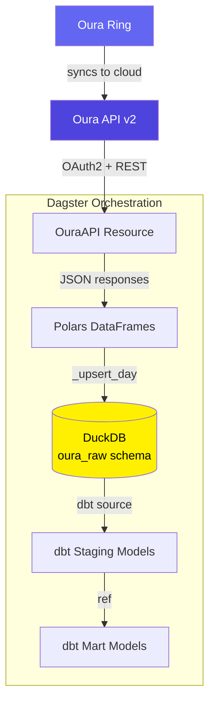
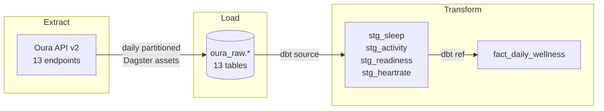
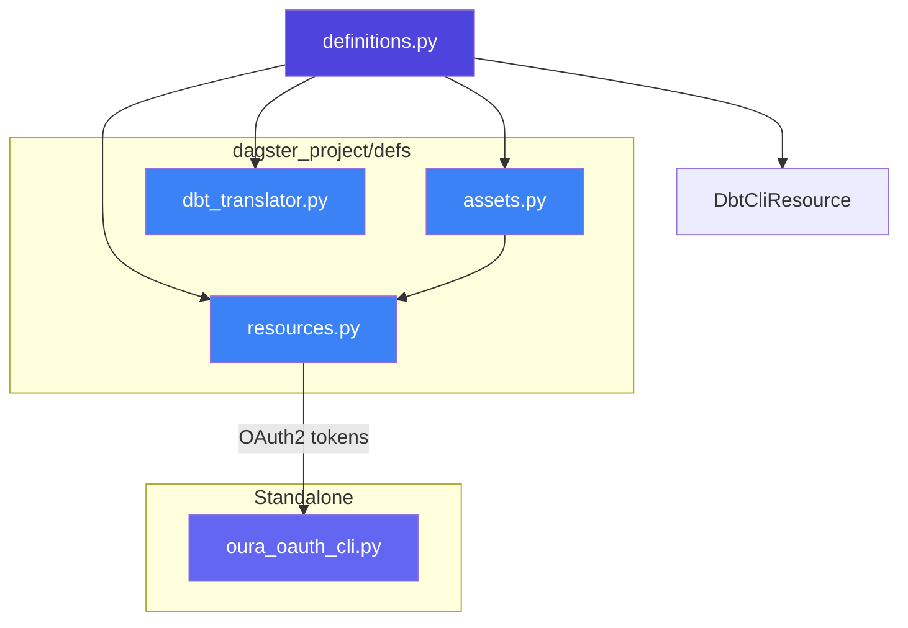
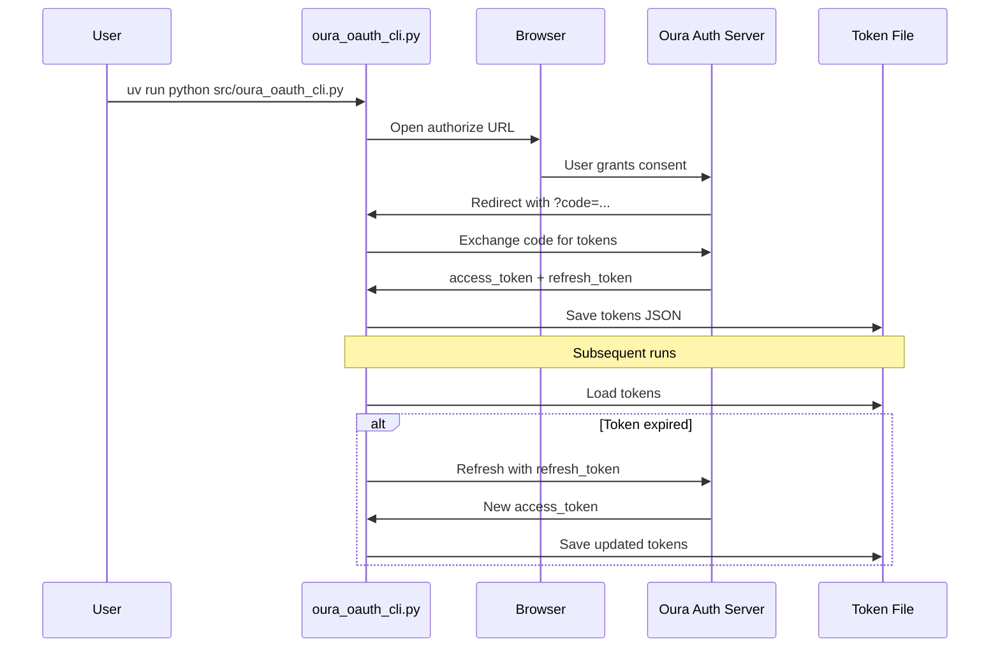

# Oura Pipeline


A personal **ELT pipeline** that pulls health and wellness data from the **Oura Ring API (v2)**, lands it in a local **DuckDB** warehouse, and transforms it through **dbt** into analysis-ready tables — all orchestrated by **Dagster**.

---

## Table of Contents

- [Overview](#overview)
- [Architecture](#architecture)
  - [High-Level Architecture](#high-level-architecture)
  - [Data Flow](#data-flow)
  - [Module Dependency Graph](#module-dependency-graph)
  - [OAuth2 Token Flow](#oauth2-token-flow)
  - [Folder Structure](#folder-structure)
- [Getting Started](#getting-started)
  - [Prerequisites](#prerequisites)
  - [Oura OAuth2 Setup](#oura-oauth2-setup)
  - [Installation](#installation)
  - [Running the Pipeline](#running-the-pipeline)
  - [Running Tests](#running-tests)
- [Environment Variables](#environment-variables)
- [Oura API Endpoints](#oura-api-endpoints)
  - [Daily Summary Assets](#daily-summary-assets)
  - [Granular / Event-Level Assets](#granular--event-level-assets)
- [dbt Models](#dbt-models)
  - [Staging](#staging)
  - [Marts](#marts)
- [Troubleshooting](#troubleshooting)
- [Contact](#contact)

---

## Overview

This pipeline **extracts** daily health metrics from an Oura Ring via the Oura API v2, **loads** them into a local DuckDB database with idempotent daily partitions, and **transforms** them through dbt staging and mart layers into a unified wellness fact table.

Key capabilities:

1. **Extracts** data from 13 Oura API v2 endpoints (sleep, activity, readiness, heart rate, SpO2, stress, and more).
2. **Loads** raw JSON responses into DuckDB's `oura_raw` schema using a delete-then-insert upsert pattern, ensuring safe re-runs and backfills.
3. **Transforms** raw data through dbt staging models into a `fact_daily_wellness` mart joining sleep, activity, and readiness scores.

---

## Architecture

### High-Level Architecture



### Data Flow



### Module Dependency Graph



### OAuth2 Token Flow



### Folder Structure

```text
oura-pipeline/
├── src/
│   ├── dagster_project/
│   │   ├── definitions.py          # Dagster entry point — wires assets, resources, dbt
│   │   └── defs/
│   │       ├── assets.py           # 13 partitioned raw assets (one per Oura endpoint)
│   │       ├── resources.py        # OuraAPI (OAuth2), DuckDBResource
│   │       └── dbt_translator.py   # Maps dbt models to Dagster asset keys + groups
│   └── oura_oauth_cli.py           # Standalone OAuth2 CLI for initial token setup
├── dbt_oura/
│   ├── dbt_project.yml             # dbt project config (profile: oura_duckdb)
│   ├── profiles.yml                # DuckDB connection profile
│   └── models/
│       ├── sources.yml             # dbt sources (oura_raw schema)
│       ├── staging/                # Staging models (stg_*)
│       └── marts/                  # Mart models (fact_*)
├── data/
│   ├── oura.duckdb                 # DuckDB database (gitignored)
│   └── tokens/                     # OAuth tokens (gitignored)
├── pyproject.toml                  # Project metadata and dependencies
└── uv.lock                         # Locked dependency versions
```

---

## Getting Started

### Prerequisites

- **Python 3.10+**
- **[uv](https://docs.astral.sh/uv/)** — Python package manager
- **Oura Ring** with an active account
- **Oura Developer App** — register at the [Oura Developer Portal](https://cloud.ouraring.com/v2/docs) to get OAuth2 client credentials

### Oura OAuth2 Setup

1. **Register an application** on the Oura developer portal.
2. Set the redirect URI to `http://127.0.0.1:8765/callback`.
3. Copy your `client_id` and `client_secret` into your `.env` file.
4. **Run the OAuth CLI** to authorize and save tokens:

```bash
uv run python src/oura_oauth_cli.py
```

This opens your browser for Oura authorization, captures the callback, and saves tokens to `data/tokens/oura_tokens.json`. Tokens auto-refresh on subsequent pipeline runs — you only need to run the CLI once.

### Installation

```bash
git clone https://github.com/cdcoonce/oura-pipeline.git
cd oura-pipeline

# Install dependencies
uv sync

# Install dbt dependencies
uv sync --extra dbt

# Copy and configure environment variables
cp .env.example .env
# Edit .env with your Oura credentials
```

### Running the Pipeline

```bash
# Start the Dagster web UI
uv run dagster dev

# Then navigate to http://localhost:3000 to materialize assets
```

From the Dagster UI, you can materialize individual assets or backfill date ranges using the daily partition selector. Partitions start from `2024-01-01`.

### Running Tests

```bash
# Run all tests
uv run pytest

# Run with coverage
uv run pytest --cov=src --cov-report=term-missing
```

---

## Environment Variables

| Variable             | Required       | Default                        | Description                                                                     |
| -------------------- | -------------- | ------------------------------ | ------------------------------------------------------------------------------- |
| `OURA_CLIENT_ID`     | Yes            | —                              | OAuth2 client ID from Oura developer portal                                     |
| `OURA_CLIENT_SECRET` | Yes            | —                              | OAuth2 client secret from Oura developer portal                                 |
| `OURA_TOKEN_PATH`    | No             | `data/tokens/oura_tokens.json` | Path to the OAuth token JSON file                                               |
| `DUCKDB_PATH`        | No             | `data/oura.duckdb`             | Path to the DuckDB database file                                                |
| `OURA_REDIRECT_URI`  | OAuth CLI only | —                              | Redirect URI for OAuth flow (e.g., `http://127.0.0.1:8765/callback`)            |
| `OURA_SCOPES`        | OAuth CLI only | —                              | Space-separated OAuth scopes (e.g., `daily heartrate workout session tag spo2`) |

---

## Oura API Endpoints

Each endpoint maps to a Dagster asset with daily partitions starting from `2024-01-01`. All raw data lands in DuckDB's `oura_raw` schema via an idempotent delete-then-insert upsert.

### Daily Summary Assets

| Asset                 | Oura Endpoint      | Description                   |
| --------------------- | ------------------ | ----------------------------- |
| `oura_raw.sleep`      | `daily_sleep`      | Daily sleep score and summary |
| `oura_raw.activity`   | `daily_activity`   | Steps, calories, and movement |
| `oura_raw.readiness`  | `daily_readiness`  | Daily readiness score         |
| `oura_raw.spo2`       | `daily_spo2`       | Blood oxygen levels           |
| `oura_raw.stress`     | `daily_stress`     | Daily stress summary          |
| `oura_raw.resilience` | `daily_resilience` | Resilience metrics            |

### Granular / Event-Level Assets

| Asset                        | Oura Endpoint      | Description                     |
| ---------------------------- | ------------------ | ------------------------------- |
| `oura_raw.heartrate`         | `heartrate`        | 5-minute heart rate samples     |
| `oura_raw.sleep_periods`     | `sleep`            | Individual sleep period details |
| `oura_raw.sleep_time`        | `sleep_time`       | Bedtime and wake time           |
| `oura_raw.workouts`          | `workout`          | Workout sessions                |
| `oura_raw.sessions`          | `session`          | Guided/unguided sessions        |
| `oura_raw.tags`              | `tag`              | User-created tags               |
| `oura_raw.rest_mode_periods` | `rest_mode_period` | Rest mode periods               |

---

## dbt Models

The dbt project (`oura_analytics`) uses DuckDB as its warehouse and follows a staging → marts layering pattern. Models are materialized as tables and grouped via `OuraTranslator` into Dagster asset groups.

### Staging

| Model           | Source               | Key Columns                                 |
| --------------- | -------------------- | ------------------------------------------- |
| `stg_sleep`     | `oura_raw.sleep`     | `day`, `total_sleep_duration`, `efficiency` |
| `stg_activity`  | `oura_raw.activity`  | `day`, `steps`, `calories`                  |
| `stg_readiness` | `oura_raw.readiness` | `day`, `readiness_score`                    |
| `stg_heartrate` | `oura_raw.heartrate` | Heart rate time series                      |

### Marts

| Model                 | Description                                                  | Key Columns                                                           |
| --------------------- | ------------------------------------------------------------ | --------------------------------------------------------------------- |
| `fact_daily_wellness` | Joins sleep, activity, and readiness into a single daily row | `day`, `readiness_score`, `steps`, `calories`, `total_sleep_duration` |

Uses `FULL OUTER JOIN` on `day` across staging models with `COALESCE` to handle days where not all data sources are available.

---

## Troubleshooting

| Symptom                                   | Likely Cause                             | Fix                                                                         |
| ----------------------------------------- | ---------------------------------------- | --------------------------------------------------------------------------- |
| `FileNotFoundError: Token file not found` | OAuth tokens haven't been created yet    | Run `uv run python src/oura_oauth_cli.py` to authorize                      |
| `401 Unauthorized` from Oura API          | Access token expired and refresh failed  | Delete `data/tokens/oura_tokens.json` and re-run the OAuth CLI              |
| `dbt source freshness` warnings           | Raw tables haven't been materialized yet | Materialize the `oura_raw_daily` asset group in Dagster first               |
| DuckDB `oura_raw` schema missing          | First run — schema hasn't been created   | Materialize any raw asset; `_upsert_day()` creates the schema automatically |
| `ModuleNotFoundError: dagster_project`    | Package not installed in editable mode   | Run `uv sync` from the project root                                         |
| Browser doesn't open during OAuth CLI     | Headless / remote environment            | Copy the printed URL manually into a browser                                |

---

## Contact

For questions or support, contact:

- **Charles Coonce** — <CharlesCoonce@gmail.com>
