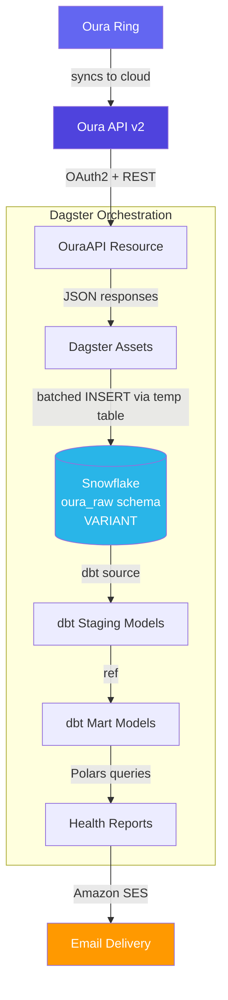
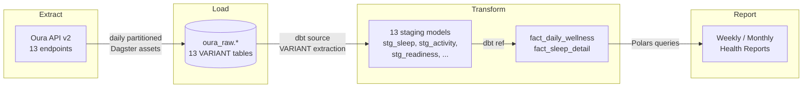
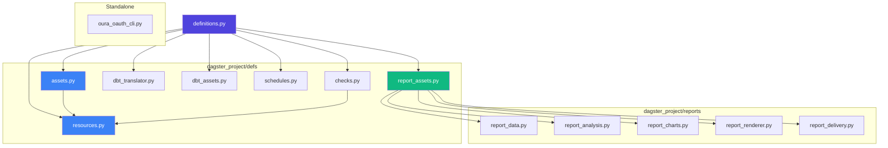
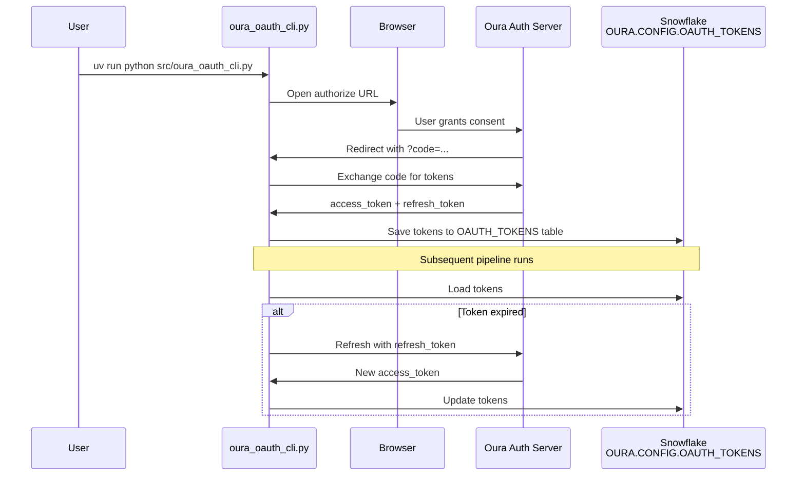

# Oura Pipeline


A personal **ELT pipeline** that pulls health and wellness data from the **Oura Ring API (v2)**, lands it in **Snowflake** as semi-structured **VARIANT** data, and transforms it through **dbt** into analysis-ready tables — all orchestrated by **Dagster**.

---

## Table of Contents

- [Overview](#overview)
- [Architecture](#architecture)
  - [High-Level Architecture](#high-level-architecture)
  - [Data Flow](#data-flow)
  - [Module Dependency Graph](#module-dependency-graph)
  - [OAuth2 Token Flow](#oauth2-token-flow)
  - [Folder Structure](#folder-structure)
- [Getting Started](#getting-started)
  - [Prerequisites](#prerequisites)
  - [Snowflake Setup](#snowflake-setup)
  - [Oura OAuth2 Setup](#oura-oauth2-setup)
  - [Installation](#installation)
  - [Running the Pipeline](#running-the-pipeline)
  - [Running Tests](#running-tests)
- [Environment Variables](#environment-variables)
- [Oura API Endpoints](#oura-api-endpoints)
  - [Daily Summary Assets](#daily-summary-assets)
  - [Granular / Event-Level Assets](#granular--event-level-assets)
- [dbt Models](#dbt-models)
  - [Staging](#staging)
  - [Marts](#marts)
- [Health Reports](#health-reports)
- [Troubleshooting](#troubleshooting)
- [Contact](#contact)

---

## Overview

This pipeline **extracts** daily health metrics from an Oura Ring via the Oura API v2, **loads** them into Snowflake as semi-structured VARIANT data with idempotent daily partitions, and **transforms** them through dbt staging and mart layers into unified wellness fact tables.

Key capabilities:

1. **Extracts** data from 13 Oura API v2 endpoints (sleep, activity, readiness, heart rate, SpO2, stress, and more).
2. **Loads** raw JSON responses into Snowflake's `oura_raw` schema as VARIANT columns using a delete-then-insert upsert pattern with temp table batching, ensuring safe re-runs and backfills.
3. **Transforms** raw VARIANT data through 13 dbt staging models into two mart tables — `fact_daily_wellness` and `fact_sleep_detail`.
4. **Reports** weekly and monthly health summaries delivered via Amazon SES email with embedded charts.

---

## Architecture

### High-Level Architecture



### Data Flow



### Module Dependency Graph



### OAuth2 Token Flow



### Folder Structure

```text
oura-pipeline/
├── src/
│   ├── dagster_project/
│   │   ├── definitions.py          # Dagster entry point — wires assets, resources, dbt
│   │   ├── defs/
│   │   │   ├── assets.py           # 13 partitioned raw assets (one per Oura endpoint)
│   │   │   ├── resources.py        # OuraAPI (OAuth2), SnowflakeResource (key-pair auth)
│   │   │   ├── checks.py           # Asset checks for row count validation
│   │   │   ├── dbt_assets.py       # dbt CLI integration with temp key file handling
│   │   │   ├── dbt_translator.py   # Maps dbt models to Dagster asset keys + groups
│   │   │   ├── report_assets.py    # Weekly/monthly report Dagster assets
│   │   │   └── schedules.py        # Job definitions and cron schedules
│   │   └── reports/
│   │       ├── report_analysis.py  # Metrics computation, trends, and insights
│   │       ├── report_charts.py    # Matplotlib chart generation (base64 PNGs)
│   │       ├── report_data.py      # Snowflake query functions (Polars DataFrames)
│   │       ├── report_delivery.py  # Amazon SES email delivery
│   │       └── report_renderer.py  # Jinja2 HTML templating
│   └── oura_oauth_cli.py           # Standalone OAuth2 CLI for initial token setup
├── dbt_oura/
│   ├── dbt_project.yml             # dbt project config (profile: oura_snowflake)
│   ├── profiles.yml                # Snowflake key-pair auth profile
│   ├── macros/
│   │   └── generate_schema_name.sql # Custom schema naming (no prefix)
│   └── models/
│       ├── sources.yml             # dbt sources (13 VARIANT tables in oura_raw)
│       ├── staging/                # 13 staging models (VARIANT → typed columns)
│       └── marts/                  # fact_daily_wellness, fact_sleep_detail
├── tests/                          # pytest suite (unit + Snowflake integration)
├── pyproject.toml                  # Project metadata and dependencies
└── uv.lock                         # Locked dependency versions
```

---

## Getting Started

### Prerequisites

- **Python 3.10+**
- **[uv](https://docs.astral.sh/uv/)** — Python package manager
- **Snowflake account** with a warehouse, database, and role configured
- **Oura Ring** with an active account
- **Oura Developer App** — register at the [Oura Developer Portal](https://cloud.ouraring.com/v2/docs) to get OAuth2 client credentials

### Snowflake Setup

1. **Create a database and schemas** in your Snowflake account:

```sql
CREATE DATABASE IF NOT EXISTS OURA;
CREATE SCHEMA IF NOT EXISTS OURA.OURA_RAW;
CREATE SCHEMA IF NOT EXISTS OURA.OURA_STAGING;
CREATE SCHEMA IF NOT EXISTS OURA.OURA_MARTS;
CREATE SCHEMA IF NOT EXISTS OURA.CONFIG;
```

2. **Generate an RSA key pair** for key-pair authentication:

```bash
# Generate private key (no passphrase)
openssl genrsa 2048 | openssl pkcs8 -topk8 -nocrypt -out rsa_key.p8

# Extract public key
openssl rsa -in rsa_key.p8 -pubout -out rsa_key.pub
```

3. **Assign the public key** to your Snowflake user:

```sql
ALTER USER OURA_PIPELINE SET RSA_PUBLIC_KEY='<contents of rsa_key.pub without header/footer>';
```

4. **Base64-encode the private key** for the `SNOWFLAKE_PRIVATE_KEY` environment variable:

```bash
base64 < rsa_key.p8 | tr -d '\n'
```

### Oura OAuth2 Setup

1. **Register an application** on the Oura developer portal.
2. Set the redirect URI to `http://127.0.0.1:8765/callback`.
3. Copy your `client_id` and `client_secret` into your `.env` file.
4. **Run the OAuth CLI** to authorize and save tokens:

```bash
uv run python src/oura_oauth_cli.py
```

This opens your browser for Oura authorization, captures the callback, and saves tokens to the `OURA.CONFIG.OAUTH_TOKENS` table in Snowflake. Tokens auto-refresh on subsequent pipeline runs — you only need to run the CLI once.

### Installation

```bash
git clone https://github.com/cdcoonce/oura-pipeline.git
cd oura-pipeline

# Install dependencies
uv sync

# Copy and configure environment variables
cp .env.example .env
# Edit .env with your Snowflake and Oura credentials
```

### Running the Pipeline

```bash
# Start the Dagster web UI
uv run dagster dev

# Then navigate to http://localhost:3000 to materialize assets
```

From the Dagster UI, you can materialize individual assets or backfill date ranges using the daily partition selector. Partitions start from `2026-01-01`.

### Running Tests

```bash
# Run all tests (unit tests only without Snowflake credentials)
uv run pytest

# Run with coverage
uv run pytest --cov=src --cov-report=term-missing
```

Snowflake integration tests require `SNOWFLAKE_ACCOUNT` in the environment and are automatically skipped when credentials are unavailable.

---

## Environment Variables

| Variable                | Required       | Description                                                          |
| ----------------------- | -------------- | -------------------------------------------------------------------- |
| `OURA_CLIENT_ID`        | Yes            | OAuth2 client ID from Oura developer portal                          |
| `OURA_CLIENT_SECRET`    | Yes            | OAuth2 client secret from Oura developer portal                      |
| `OURA_REDIRECT_URI`     | OAuth CLI only | Redirect URI for OAuth flow (e.g., `http://127.0.0.1:8765/callback`) |
| `OURA_SCOPES`           | OAuth CLI only | Space-separated OAuth scopes                                         |
| `SNOWFLAKE_ACCOUNT`     | Yes            | Snowflake account identifier (e.g., `xy12345.us-east-1`)             |
| `SNOWFLAKE_USER`        | Yes            | Snowflake user name                                                  |
| `SNOWFLAKE_PRIVATE_KEY` | Yes            | Base64-encoded PEM private key for key-pair authentication           |
| `SNOWFLAKE_WAREHOUSE`   | Yes            | Snowflake warehouse name (e.g., `COMPUTE_WH`)                        |
| `SNOWFLAKE_DATABASE`    | Yes            | Snowflake database name (e.g., `OURA`)                               |
| `SNOWFLAKE_ROLE`        | Yes            | Snowflake role (e.g., `TRANSFORM`)                                   |
| `DAGSTER_HOME`          | No             | Dagster home directory                                               |
| `SES_SENDER_EMAIL`      | Reports only   | Amazon SES sender email address                                      |
| `SES_RECIPIENT_EMAIL`   | Reports only   | Amazon SES recipient email address                                   |
| `AWS_REGION`            | Reports only   | AWS region for SES (e.g., `us-east-1`)                               |

---

## Oura API Endpoints

Each endpoint maps to a Dagster asset with daily partitions starting from `2026-01-01`. All raw data lands in Snowflake's `oura_raw` schema as VARIANT columns via an idempotent delete-then-insert upsert with temp table batching.

### Daily Summary Assets

| Asset                 | Oura Endpoint      | Description                   |
| --------------------- | ------------------ | ----------------------------- |
| `oura_raw.sleep`      | `daily_sleep`      | Daily sleep score and summary |
| `oura_raw.activity`   | `daily_activity`   | Steps, calories, and movement |
| `oura_raw.readiness`  | `daily_readiness`  | Daily readiness score         |
| `oura_raw.spo2`       | `daily_spo2`       | Blood oxygen levels           |
| `oura_raw.stress`     | `daily_stress`     | Daily stress summary          |
| `oura_raw.resilience` | `daily_resilience` | Resilience metrics            |

### Granular / Event-Level Assets

| Asset                        | Oura Endpoint      | Description                     |
| ---------------------------- | ------------------ | ------------------------------- |
| `oura_raw.heartrate`         | `heartrate`        | 5-minute heart rate samples     |
| `oura_raw.sleep_periods`     | `sleep`            | Individual sleep period details |
| `oura_raw.sleep_time`        | `sleep_time`       | Bedtime and wake time           |
| `oura_raw.workouts`          | `workout`          | Workout sessions                |
| `oura_raw.sessions`          | `session`          | Guided/unguided sessions        |
| `oura_raw.tags`              | `tag`              | User-created tags               |
| `oura_raw.rest_mode_periods` | `rest_mode_period` | Rest mode periods               |

---

## dbt Models

The dbt project (`oura_analytics`) uses **Snowflake** as its warehouse with key-pair authentication and follows a staging → marts layering pattern. Raw data is stored as **VARIANT** (semi-structured JSON) and extracted into typed columns in staging. Models are materialized as tables and grouped via `OuraTranslator` into Dagster asset groups.

### Staging

13 staging models extract typed columns from raw VARIANT data using Snowflake's `raw_data:field::type` syntax.

| Model                   | Source                       | Key Columns                                         |
| ----------------------- | ---------------------------- | --------------------------------------------------- |
| `stg_sleep`             | `oura_raw.sleep`             | `day`, `sleep_score`, `total_sleep_duration`        |
| `stg_activity`          | `oura_raw.activity`          | `day`, `steps`, `calories`                          |
| `stg_readiness`         | `oura_raw.readiness`         | `day`, `readiness_score`, contributors              |
| `stg_heartrate`         | `oura_raw.heartrate`         | `ts`, `bpm`                                         |
| `stg_spo2`              | `oura_raw.spo2`              | `day`, `avg_spo2_pct`                               |
| `stg_stress`            | `oura_raw.stress`            | `day`, `stress_high`, `recovery_high`               |
| `stg_resilience`        | `oura_raw.resilience`        | `day`, `resilience_level`                           |
| `stg_sleep_periods`     | `oura_raw.sleep_periods`     | `day`, `type`, `total_sleep_duration`, `efficiency` |
| `stg_sleep_time`        | `oura_raw.sleep_time`        | `day`, `optimal_bedtime_start`                      |
| `stg_workouts`          | `oura_raw.workouts`          | `day`, `activity`, `duration`, `calories`           |
| `stg_sessions`          | `oura_raw.sessions`          | `day`, `type`, `duration`                           |
| `stg_tags`              | `oura_raw.tags`              | `day`, `tag`                                        |
| `stg_rest_mode_periods` | `oura_raw.rest_mode_periods` | `day`, `start_time`, `end_time`                     |

### Marts

| Model                 | Description                                                                       | Join Strategy                              |
| --------------------- | --------------------------------------------------------------------------------- | ------------------------------------------ |
| `fact_daily_wellness` | Joins readiness, activity, sleep, spo2, stress, and resilience into one daily row | `FULL OUTER JOIN` on `day` with `COALESCE` |
| `fact_sleep_detail`   | Joins sleep periods with sleep time recommendations                               | `LEFT JOIN` on `day`                       |

---

## Health Reports

The pipeline generates **weekly** and **monthly** health reports delivered via Amazon SES email with embedded Matplotlib charts.

**Report contents:**

- Daily wellness scores trend (readiness, sleep, activity)
- Steps and calorie tracking
- Sleep stage breakdown
- HRV trend analysis
- Personal bests and areas to improve
- Workout summaries

**Schedules:**

- **Weekly report:** Monday 7:00 AM UTC
- **Monthly report:** 1st of month 7:00 AM UTC

Reports require the `SES_SENDER_EMAIL`, `SES_RECIPIENT_EMAIL`, and `AWS_REGION` environment variables. Both schedules are stopped by default — enable them in the Dagster UI.

---

## Troubleshooting

| Symptom                                      | Likely Cause                             | Fix                                                                              |
| -------------------------------------------- | ---------------------------------------- | -------------------------------------------------------------------------------- |
| `FileNotFoundError: Token file not found`    | OAuth tokens not yet seeded in Snowflake | Run `uv run python src/oura_oauth_cli.py` to authorize and store tokens          |
| `401 Unauthorized` from Oura API             | Access token expired and refresh failed  | Re-run the OAuth CLI to re-authorize                                             |
| `dbt source freshness` warnings              | Raw tables haven't been materialized yet | Materialize the `oura_raw_daily` asset group in Dagster first                    |
| Snowflake `oura_raw` schema missing          | First run — schema hasn't been created   | Run the Snowflake setup SQL from the [Getting Started](#snowflake-setup) section |
| `ModuleNotFoundError: dagster_project`       | Package not installed in editable mode   | Run `uv sync` from the project root                                              |
| Browser doesn't open during OAuth CLI        | Headless / remote environment            | Copy the printed URL manually into a browser                                     |
| Heartrate asset hangs or times out           | Too many rows for per-row INSERT         | Verify `_upsert_day()` is using temp table batching (default in current code)    |
| `InsufficientDataError` in report generation | Fewer than 2 days of data for the period | Backfill more days of raw data before running reports                            |

---

## Contact

For questions or support, contact:

- **Charles Coonce** — <CharlesCoonce@gmail.com>
